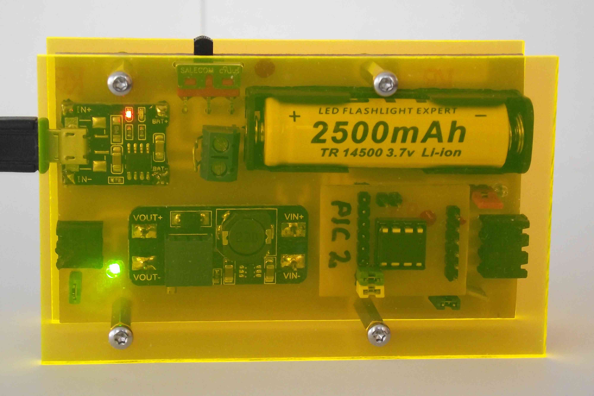

Pi-USV
======

Overview
--------

A do-it-yourself UPS for the Raspberry Pi:

The UPS is connected to the Pi using two GPIO-pins. The UPS signals
the state of the battery to the Pi and the supervisor-service reacts
by calling appropriate hook-scripts.

The system supports four states:

  - **O**K: battery voltage is high
  - **W**ARN: battery voltage is low
  - **C**RIT: battry voltage is critical, shutdown to be expected soon
  - **S**DOWN: shutdown initiated

Hardware
--------

For details about the hardware, browse the
[hardware-directory](hardware/Readme.md "hardware-directory").

Software
--------

The software consists of a systemd-service `pi-usv.service` with the
backing script `/usr/local/sbin/pi-usv.py` and four example hook-scripts
in `/usr/local/sbin` for state-changes:

| State | Command              | Default action                     |
| ------|----------------------|------------------------------------|
| **O** | `pi-usv-ok.sh`       | remount partitions with async-flag |
| **W** | `pi-usv-warn.sh`     | remount partitions with sync-flag  |
| **C** | `pi-usv-crit.sh`     | remount partitions with sync-flag  |
| **S** | `pi-usv-shutdown.sh` | execute `halt -p`                  |

All scripts also send a warning to users logged in. If your Pi is a
headless server, you might want to change this and e.g. send a
mail instead.

Installation
------------

Install the pi-usv-service with the commands

    git clone https://github.com/bablokb/pi-usv.git
    cd pi-usv
    sudo tools/install
    cd ..
 
    git clone https://github.com/bablokb/gpio-poll-service.git
    cd gpio-poll-service
    sudo tools/install
 
    # optional (desktop-system)
    sudo apt-get -y install libnotify-bin notification-daemon at-spi2-core
    echo '@/usr/lib/notification-daemon/notification-daemon' >> $HOME/.config/lxsession/LXDE-pi/autostart

The last block of commands is only needed on a desktop system and
installs the notifcation-daemon which displays pop-up messages on the
desktop.

Configuration
-------------

If you don't use GPIOs 17 and 27 then you need to edit
`/etc/gpio-poll.conf` and `/etc/pi-usv.conf`. Also, if you want to run
your own shutdown-hook, add it to the latter one.

You should modify the scripts `/usr/local/sbin/pi-usv-{ok,warn,crit,shutdown}.sh`
to suit your needs.

After you configured everything, reboot the system.
